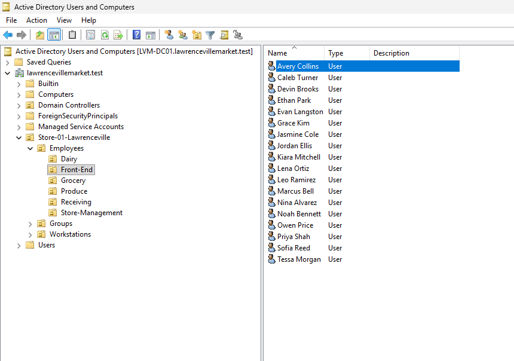
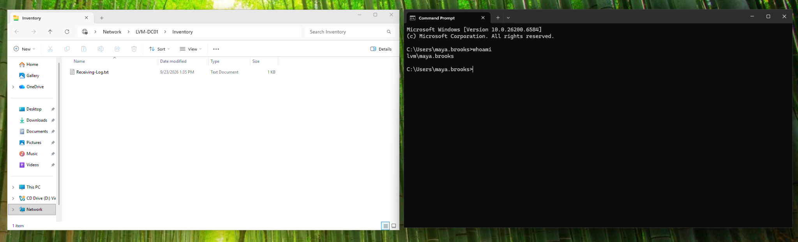

# Lawrenceville Market IT Support Lab

I built a Windows domain in VirtualBox for a fictional grocery store. The goal was to practice Active Directory setup, employee onboarding, access permissions, and help-desk documentation.

## Lab setup

| VM | Role | IP address |
| --- | --- | --- |
| `LVM-DC01` | Windows Server 2022; Active Directory, DNS, and file sharing | `10.30.40.10` |
| `LVM-CL01` | Windows 11 domain-joined workstation | `10.30.40.20` |

Both VMs use the `LVM-LAB` VirtualBox network (`10.30.40.0/24`). The domain is `lawrencevillemarket.test`.

## What I did

- Created OUs for Front-End, Receiving, Store-Management, Grocery, Produce, and Dairy.
- Used a [CSV roster](employees.csv) and [PowerShell script](Import-StoreEmployees.ps1) to add 38 employees to the correct OUs. With two accounts created earlier, the store has **40 employee accounts**.
- Set up the `\\LVM-DC01\Inventory` share and used a security group to give Receiving staff access. I tested that Maya (Receiving) could open it and Evan (Front-End) could not.
- Linked a Group Policy to the workstation OU that sets a 10-minute inactivity lock. I confirmed the setting applied on the client.
- Troubleshot client IP addressing and external DNS, and wrote down the steps as support tickets.

## Screenshots

**Front-End employee accounts in Active Directory**



**Maya opening the Inventory share on the domain workstation**



More evidence: [department OUs](screenshots/ad-ou-structure.png), [40-account check](screenshots/ad-employee-count-40.png), [Inventory group members](screenshots/inventory-group-members.png), [Evan denied access](screenshots/inventory-access-denied-evan.png), [GPO link](screenshots/gpo-workstations-link.png), and [600-second setting](screenshots/gpo-inactivity-600-seconds.png).

## Help-desk tickets

| Ticket | Issue |
| --- | --- |
| [TKT-001](tickets/TKT-001-inventory-access.md) | Receiving employee could not access the Inventory share |
| [TKT-002](tickets/TKT-002-password-reset.md) | Front-End employee needed a password reset |
| [TKT-003](tickets/TKT-003-client-addressing.md) | Workstation received a `169.254.x.x` address |
| [TKT-004](tickets/TKT-004-external-dns.md) | Workstation could not resolve external websites |
| [TKT-005](tickets/TKT-005-new-starter-onboarding.md) | Onboarded 38 new employees |

## Reproducing the employee import

On the domain controller, place `employees.csv` and `Import-StoreEmployees.ps1` in the same folder. Preview the roster before running the import:

```powershell
.\Import-StoreEmployees.ps1 -Preview
.\Import-StoreEmployees.ps1
```

The script checks the expected OUs and accounts, generates temporary passwords, and requires users to change them at first sign-in. It was written for this lab's starting roster, so it stops if the accounts already exist. Temporary passwords stay on the server and **are not included in this repository**.

**NOTE:** All company and employee names are fictional. The VMs and password files are not included.
